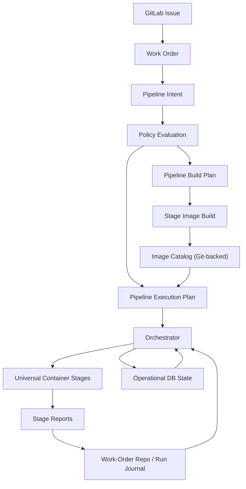
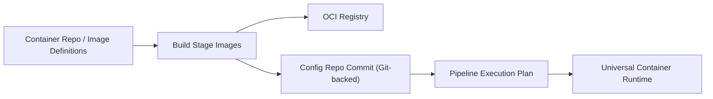

# Pipeline Workflow

This document is the canonical end-to-end workflow view for Autodev.

The key idea is:

- an issue does not directly execute a fixed pipeline
- issue type constrains which pipeline families may exist
- the same issue type may admit multiple candidate pipeline families or
  implementation strategies
- an issue is translated into intent
- policy constrains that intent
- the platform materializes an executable pipeline plan
- the platform can also build the stage images that plan depends on
- execution produces a durable run journal in Git and operational state in the DB

The important invariant is:

- the meta-pipeline output is not an informal runtime decision
- the meta-pipeline output is the valid, static, policy-constrained
  configuration required to execute a real pipeline
- that output binds universal stages to universal containers by immutable
  image reference and validated contract

## Core Flow



## What "The Pipeline Materializes Itself" Means

Autodev is not a fixed hard-coded pipeline with a few parameters.

Instead:

1. The issue expresses intent.
2. The work order turns that into canonical machine-readable input.
3. Policy narrows what kind of pipeline may exist.
4. The platform materializes:
   - the stage graph
   - the container images
   - the execution identities
   - the writable surfaces
   - the success criteria
   - the pipeline family selected for the issue type
   - the optimization goals for that issue family
   - the immutable testing / inspection policy
   - the reports required from each stage
5. The resulting execution plan is what actually runs.

So the pipeline that runs is itself a build artifact derived from:

- intent
- policy
- available stage/container capabilities

More precisely, the materialized output of the meta-pipeline is:

- a `PipelineExecutionPlan`
- that references universal stage contracts
- that references universal container images by immutable digest
- plus the static validated config required to execute that pipeline safely

That means the platform does not execute issue text directly. It executes the
resolved plan artifact produced by the meta-pipeline.

That plan should eventually support:

- parallel stage groups
- gather/adjudication stages
- bounded loop groups
- candidate strategy sets for the same issue

The first concrete version of that now exists in the `plan` stage output as:

- `pipeline_intent`
- `policy_evaluation`
- `pipeline_build_plan`
- `pipeline_execution_plan`

Those artifacts are emitted by the universal container runtime and recorded in
the work-order journal through the stage report and run index.

`policy_evaluation` now includes a `pipeline_scope` hierarchy plus a `stage_scope`
map so every stage can look up the exact constraints and contract that applied to
it (`run_as`, `write_as`, allowed surfaces, required outputs, success
criteria, image digest, etc.). The orchestration control plane always prefers the
Git-backed `policy_evaluation`/`pipeline_execution_plan` files from the
work-order journal when reconstructing the plan, making the durable journal the
single source of truth for policy shape and execution metadata.

## Issue Types And Pipeline Families

Pipelines are not only for products. They are for issue families.

Examples:

- bug fixes
- new features
- major refactors
- new products

The checked-in pipeline catalog now declares:

- which issue types exist
- which pipeline families accept them
- which optimization goals matter for that family
- which immutable testing policy applies
- whether a new pipeline may be materialized when no existing family accepts
  the issue and the issuer has authority

So the materializer does not ask only "what product is this?"

It also asks:

- what kind of issue is this?
- which pipeline shape is optimal for this issue family?
- is the issuer allowed to create a new pipeline family if none exists?

## Testing As Inspection Contracts

Autodev now uses a broader definition of test.

Every inspection point is modeled as a test surface, for example:

- spec testing
- security testing
- architecture testing
- performance testing
- functional testing

The pipeline catalog also defines testing policies that can require:

- tests before implementation
- immutable test/inspection surfaces
- unreadable but executable tests for the agent

The intended development pattern is:

1. build a test plan
2. materialize tests from that plan
3. run parallel inspection/test surfaces
4. gather all findings into one coherent remediation model
5. implement against the gathered model
6. re-run the same inspection surfaces
7. adjudicate or iterate

This is intentionally a scatter-gather model, not a tactical one-failure-at-a-time model.

The same issue may also be executed through multiple candidate pipelines or
implementation strategies in parallel. Those candidates should share:

- the same issue/work-order contract
- the same policy constraints
- the same pinned repo baseline
- the same immutable testing surfaces

and differ only in the pipeline topology or implementation strategy being evaluated.

The winner should be selected by issue-family fitness after hard admissibility
gates have already passed.

That means the development pipeline can eventually enforce a model where the
agent implements to the specification and the executable contract, not by
reverse-engineering visible tests.

## Universal Stages And Universal Containers

Autodev has two reusable execution primitives:

### Universal stage

The universal stage is the contract shape. It defines:

- inputs
- outputs
- success criteria
- identities
- materialized surfaces
- report requirements
- transitions

### Universal container

The universal container is the execution substrate. It defines:

- image digest
- runtime entrypoint
- installed tooling
- runtime user expectations
- filesystem/runtime enforcement boundary

### Meta-pipeline output

The meta-pipeline binds those two primitives together into a concrete
executable plan:

- which stages exist
- which containers execute them
- which repos and refs are materialized
- which surfaces are mounted
- which identities and permissions apply
- which success contracts must be satisfied

That plan is the thing that actually runs.

## Durable vs Operational State

Autodev splits state intentionally.

### Git-backed durable state

- work orders
- stage reports
- run index
- release manifests
- generated outputs that matter durably
- GitOps desired state
- stage image catalog
- policy and config contracts

### DB-backed operational state

- queued runs
- stage attempts
- leases and heartbeats
- realtime stage state
- locks
- signals
- ratchet aggregation
- timing and cost rollups

This keeps the durable audit trail in Git while preserving fast coordination and
realtime observability in the database.

## Execution Boundary

Autodev has three distinct layers of responsibility.

### Config

Git-backed config is the contract surface. It declares:

- stage behavior
- container behavior
- identities
- permissions
- materialized surfaces
- success criteria
- policy inputs

### Go orchestrator

Go is the orchestration layer only. It:

- loads and propagates contracts
- manages stage lifecycle
- launches the configured container runtime
- validates declared outputs against the contract
- records Git/DB/GitLab state

Go does not own stage business logic.

### Runtime and container

The container runtime and OS enforce:

- runtime users
- mounts
- writable surfaces
- network/capability boundaries

The universal container primitive owns everything inside the container.

## Stage Image Build Loop

The platform is moving toward a self-hosting model where it builds the stage
images it later consumes.



This is important because policy and config can shape the built execution
substrate, not just the runtime plan.

The resulting trusted config commit is then an input into pipeline
materialization, so the final execution plan can bind stage contracts to
immutable container digests instead of loose tags or mutable runtime choices.

Policy changes should also shape this loop. When prose policy changes, affected
stage images should rebuild and affected pipeline families should rematerialize
so policy becomes an immutable structural control, not just a runtime advisory.

## Self-host Validation Lane

A self-host validation lane now runs as part of the image build job. After
`tools/build_stage_images.py` currently builds the stage image set from
`containers/runtime-substrate.commit`, the
same job executes:

```
./bin/stage-runner --config autodev.meta.json local --issue hack/e2e-pipeline-issue.json --smoke-secrets hack/smoke-secrets.json
```

That ensures the newly built stage images can actually execute the
materialized pipeline plan derived from the `meta` work order, the policy
evaluation, and the stage catalog loaded into the container.

You can reproduce the same validation locally with `make meta-validate`; the
target now builds the stage images via `make build-stage-images` before invoking
the runner so the same runtime substrate commit that drove the build also
drives the meta-pipeline in the same invocation.

Target governance model:

- move the trust anchor to a separate hardened config repo
- trust `main` in that repo only as the governance baseline
- build artifacts pin an exact config commit
- runtime trusts only that exact config commit, never a floating branch name
- each pipeline is a branch derived from `main`
- upgrades are handled by rebasing pipeline branches onto new `main`,
  rebuilding, and validating legacy vs upgraded pipelines in parallel

## Per-Run Journal Layout

The work-order repo is the canonical run journal.

Typical layout:

```text
work-orders/<work-order-id>/work-order.json
work-orders/<work-order-id>/runs/<run-id>/index.json
work-orders/<work-order-id>/runs/<run-id>/stages/<stage>/attempt-XX/summary.json
work-orders/<work-order-id>/runs/<run-id>/stages/<stage>/attempt-XX/report.json
```

Additional durable documentation surfaces should also be materialized from the
pipeline:

- repo docs for product/runtime documentation
- GitLab wiki Git surfaces for architecture docs, implementation notes,
  roadmaps, and other knowledge documents

That means:

- later stages can read prior reports from Git
- humans can inspect the full run in one place
- the orchestrator can index those Git commits in the DB

## Policy Hierarchy

Policy is prose-first and hierarchical.

It should constrain pipeline materialization at every level:

- global
- pipeline-family
- environment
- repo/component
- stage

The executable plan is the intersection of:

- intent
- capabilities
- policy

## Document Map

Use the docs this way:

- [README.md](/Users/tony/mph.tech/worktrees/codex/autodev/README.md)
  - concise architecture overview
- [PIPELINE_WORKFLOW.md](/Users/tony/mph.tech/worktrees/codex/autodev/PIPELINE_WORKFLOW.md)
  - end-to-end workflow and self-materialization model
- [PRIMITIVES.md](/Users/tony/mph.tech/worktrees/codex/autodev/PRIMITIVES.md)
  - ownership boundaries and lifecycles
- [OPERATIONS.md](/Users/tony/mph.tech/worktrees/codex/autodev/OPERATIONS.md)
  - how to run and operate the system
- [IMPLEMENTATION_STATUS.md](/Users/tony/mph.tech/worktrees/codex/autodev/IMPLEMENTATION_STATUS.md)
  - what is done, first pass, and remaining
