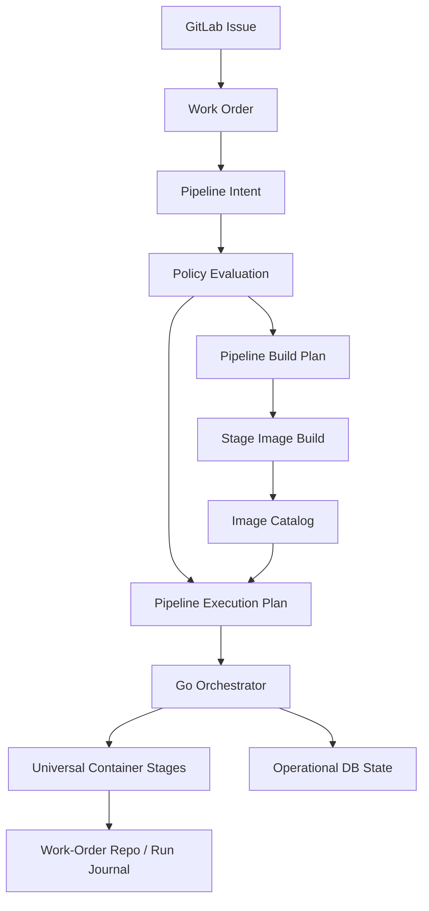

# Autodev

Autodev is a GitLab-issue-centric autonomous delivery platform scaffold.
GitLab issues are the human-visible request and audit surface. Internally,
Autodev translates those issues into canonical work orders, schedules typed
stage attempts, records evidence, emits ratchets and signals, and prepares
GitOps-oriented promotion and rollback actions.

## Current Refactor Docs

The active config/runtime simplification is documented explicitly here:

- [FINAL_FORM.md](/Users/tony/mph.tech/worktrees/codex/autodev/FINAL_FORM.md)
- [IMPLEMENTATION_PLAN.md](/Users/tony/mph.tech/worktrees/codex/autodev/IMPLEMENTATION_PLAN.md)

Those documents are the authoritative description of the target model and the
slice plan to get there. They intentionally distinguish between:

- target architecture
- current code reality

## Current Shape

Today the platform has these major slices in place:

- `control-plane`: issue intake, run creation, DAG scheduling, worker claim /
  heartbeat / complete, approval gating, rollback queueing, stats aggregation,
  and pipeline signal emission.
- `stage-runner`: isolated stage execution, prompt/tooling injection, secret
  resolution, invariant loading, artifact publication, per-stage stats, and a
  universal container runtime path driven by stage config.
- `agent plane`: a bounded `internal/agent` interface for model-backed stage
  reasoning. The default runtime uses a noop driver until individual stages opt
  in.
- `container runtime`: `autodev-stage-runtime` is a tiny Go binary built from
  `tooling/runtime/single_plane.go`. It owns in-container contract execution,
  runs configured command steps, records state transitions as evidence, and
  keeps stage behavior out of orchestration.
- `universal runtime substrate`: all stage images now descend from the same
  immutable universal base image built from `docker/runner/Dockerfile`; stage
  images are explicit descendants, not ad hoc alternate runtimes.
- `repo plane`: `internal/repos` owns repo discovery and source stamping for
  local checkouts.
- `work order model`: one delivery object can span multiple independently
  deployable components such as `api`, `console`, `prompts`, `config`,
  `mobile`, and `docs`, including component dependency ordering and
  per-component source stamps.
- `ratchets`: Postgres-backed finding aggregation, invariant proposals, active
  invariants, and stage-ranked retrieval.
- `signals`: Postgres-backed pipeline events and synthesized operational
  signals for failures, timing regressions, cost anomalies, and contention.
- `GitLab adapter`: file-backed local mode plus a first-pass self-hosted
  GitLab API adapter.
- `GitOps flow`: modeled in the domain and DAG, but still synthetic at the
  actual promotion/observation stage bodies.

## Architectural Decisions

The current target architecture makes these strong decisions:

- **multiple repos, not one monorepo transport**. Durable authored, generated,
  governed, journal, and GitOps state may live in separate repositories. A
  single work order can span many repos and still be treated as one delivery
  object.
- **Git for durable state**. Work orders, durable stage outputs, generated
  outputs, governed changes, release manifests, and GitOps promotions should
  land in Git-backed repos.
- **Postgres for operational state**. Leases, heartbeats, claims, retries,
  locks, signals, ratchets, and fast correlation queries live in Postgres.
- **different execution identities are a security boundary**. `agent`,
  `generator`, and `governed` should ultimately run under separate
  OS/container identities, not just separate policy labels.
- **config is the contract surface**. Stage behavior, container behavior,
  mounts, identities, runtime requirements, hooks, and output expectations are
  declared in Git-backed config, not invented in Go.
- **the DB indexes Git state rather than replacing it**. Operational records
  should carry commit SHAs, GitOps commits, artifact digests, and release IDs
  so the system can pivot quickly between runtime state and durable Git state.
- **policy constrains materialization at every layer**. Issues and work orders
  do not materialize arbitrary pipelines. Intent is reduced by policy into an
  executable plan, and each stage is further narrowed by stage-scoped policy
  before it runs.

That boundary is intentional:

- Go propagates contracts, orchestrates lifecycle, and records state
- the container runtime and OS enforce execution boundaries
- the universal container primitive owns everything inside the container

Go does not cross the orchestration boundary into stage business logic.

The intended materialization chain is:

- `Issue`
- `WorkOrder`
- `PipelineIntent`
- `PolicyEvaluation`
- `PipelineBuildPlan`
- `PipelineExecutionPlan`
- `RunJournal`

The executable plan should always be the policy-constrained result of intent,
not a direct fallthrough from issue text.

### Workflow View

The docs now have a dedicated workflow view in
[PIPELINE_WORKFLOW.md](/Users/tony/mph.tech/worktrees/codex/autodev/PIPELINE_WORKFLOW.md).

At a high level, Autodev works like this:



That is the core self-materialization model:

- the issue does not directly execute a fixed hard-coded pipeline
- the platform materializes the executable plan from intent, policy, and available stage/container capabilities
- issue type now participates directly in that materialization:
  - the work order declares the `issue_type`
  - the checked-in pipeline catalog declares which pipeline families accept which issue types
  - the plan stage selects an existing pipeline family or materializes a new
    pipeline family only when the issuer has explicit authority to do so
- pipeline statistics are now part of the design target, not an afterthought:
  the selected pipeline carries optimization goals so later ratchets can tune
  pipeline shape to issue families such as bug fixes, new features, major
  refactors, and new products
- issue families are also expected to support multiple candidate pipelines and
  implementation strategies for the same issue, with the winner selected by
  fitness to the use case rather than first success alone
- the platform can also build the stage images that plan depends on
- the `build-stage-images` job now builds reusable stage images from
  `containers/runtime-substrate.commit`, emits a non-trust build report, and immediately runs a self-host
  validation lane that uses `autodev.meta.json` plus
  `hack/e2e-pipeline-issue.json`. This guarantees the materialized pipeline
  can execute against the stage images produced by that same job. The same
  sequence can be reproduced locally with `make meta-validate`, which now
  builds the stage images via `make build-stage-images` before invoking the
  validator so the commit that drives the pipeline is the same commit that
  spawned the stage images.
- the work-order repo becomes the durable run journal for what actually happened

The important invariant is:

- the meta-pipeline output is a valid, static, policy-constrained
  `PipelineExecutionPlan`
- that plan binds universal stage contracts to universal container images by
  immutable reference
- execution runs that plan artifact, not raw issue text or ad hoc runtime
  decisions

## Governance Strategy

The intended long-term governance model is:

- one separate hardened config repo
- `main` in that config repo is the baseline
- each pipeline is a branch derived from `main`
- pipeline upgrades happen by rebasing pipeline branches onto newer `main`
- runtime trusts only exact config commits, never floating branch names

That means the trust chain should be:

- config repo identity
- config commit SHA
- stage image digests derived from that commit
- materialized execution plan derived from that commit

The platform repo should not be a second mutable config authority. It should
consume a baked config-repo commit and execute only what is derivable from it.

The practical migration model is:

1. create a pipeline branch from the current `main` commit
2. evolve `main` through PR/CI in the config repo
3. rebuild descendant pipelines from the new `main`
4. run upgraded and legacy pipelines in parallel against the same workloads
5. cut traffic over only after evidence says the upgraded branch is correct

The first concrete materialization slice now exists in the `plan` stage:

- `pipeline_intent`
- `policy_evaluation`
- `pipeline_build_plan`
- `pipeline_execution_plan`

Those artifacts now also carry:

- `issue_type`
- selected `pipeline_family`
- `pipeline_selection` (`selected` or `created`)
- `accepted_issue_types`
- pipeline `optimization_goals`
- immutable `testing` policy, including inspection points

Autodev now treats every inspection gate as a test surface:

- spec testing
- security testing
- architecture testing
- performance testing
- functional testing

For development-oriented pipeline families, the testing policy can require a
tests-before-implementation strategy where the tests are immutable, executable,
and intentionally unreadable by the agent. That policy is now a first-class
contract in the work order and the pipeline catalog, even before the execution
graph itself is specialized around it.

The intended development lane is test-plan first:

- `build_test_plan`
- `materialize_tests`
- parallel inspection fan-out
- `gather_findings`
- `implement`
- parallel re-test
- `adjudicate_candidates`

The important rule is that the implementation stage should consume a gathered
problem model, not a stream of tactical failures one by one. That keeps the
system optimizing for coherent change sets instead of compounding spaghetti
fixes.

Scatter-gather testing is also a first-class design goal:

- security, architecture, performance, spec, and functional testing should be
  able to run in parallel
- one gather stage should reason over all results together
- bounded loops should allow repeated fan-out / gather / implement cycles
- the same issue should be able to run through multiple candidate pipelines or
  implementation strategies in parallel against the same immutable test and
  policy contract

Winner selection should then be based on issue-family fitness, for example:

- bug fixes optimize for regression safety and blast-radius minimization
- new features optimize for spec fitness, extensibility, and docs completeness
- major refactors optimize for architectural coherence and maintainability
- new products optimize for contract completeness, operability, and platform fit

Those artifacts are emitted by the universal container runtime, stored as stage
artifacts, persisted onto the run metadata, and preserved in the work-order
journal both through the stage report and dedicated files under
`runs/<run-id>/pipeline/`.

`policy_evaluation` now carries both a `pipeline_scope` hierarchy and a
`stage_scope` map so each stage can see the precise contract that constrained it
(`run_as`, `write_as`, allowed surfaces, required outputs, success criteria,
and image digest). The control plane prefers the Git-backed `policy_evaluation`
and `pipeline_execution_plan` files from the work-order journal before falling
back to the DB metadata, so the enforced policy shape is the durable source of
truth for every stage.

The control plane also threads any journal metadata exposed by stage outputs
into run/attempt persistence. When stages publish component commit information,
release manifests, or promotion-plan summaries, that data appears as
`journal_entry` on the attempt and a `journal_history`/`last_journal` tuple on
the run, giving you a direct, queryable trace of the journal surface alongside
the usual artifacts and Git state.

The latest durability slice also records:

- `work_order_commit` on the run when the canonical work order is committed to
  the work-order repo
- `generator_commit` on attempts and aggregated `generator_commits` on the run
  when `generate` commits durable materialized outputs
- `promotion_gitops_commit` on attempts and aggregated `promotion_commits` on
  the run when `promote_*` commits GitOps changes
- `mr_proposal` from `implement` and a typed promotion proposal surface in
  `internal/gitlab`, plus real GitLab MR upsert plumbing so stage outputs can
  directly create or update implementation and promotion merge requests when a
  real GitLab adapter is configured
- typed GitLab create-MR request builders in `internal/gitlab` for both
  implement and promotion proposal payloads

### Runtime Substrate Build Surface

The platform now has a first-pass stage-image build lane:

- today, `containers/runtime-substrate.commit` is the local placeholder trust
  anchor inside this repo
- `tools/build_stage_images.py` materializes that commit and builds the
  reusable stage image set from it
- `internal/stagecontainer` resolves stage images only from:
  - stage name
  - `runtime-substrate.commit`
- `gitlab/pipeline.yml` includes a `build-stage-images` job that builds the
  stage image set and publishes a non-trust build report artifact

Current shape:

- `docker/runner/Dockerfile` builds the universal runtime substrate
- per-stage image refs are derived from the same commit and substrate

This is the thinnest self-hosting slice: the pipeline now builds the stage
substrates it intends to run from one Git commit, and runtime only trusts
artifacts derivable from that commit.

Target end state:

- replace the in-repo `runtime-substrate.commit` file with a baked config-repo
  identity + config commit
- derive the same stage image digests from that external governed config repo
- keep the runtime checks the same:
  - run declares config commit `C`
  - stage image digest matches what `C` produces

Long term, policy changes should also participate in this build loop:

- prose policy changes
- affected stage images rebuild
- affected pipeline families rematerialize
- new immutable digests become the only admissible execution substrates

### Git-backed work-order journal

Set `paths.work_order_repo` in the active config file to a writable Git repo
(default `data/work-orders`). Each run creation writes the canonical work order
into that repo, commits it, and stores the resulting SHA as
`run.Metadata["work_order_commit"]`, giving you a durable pointer into a
Git-backed journal surface even when runtime state is rebuilt or replaced.

Every completed stage now also writes:

- `runs/<run-id>/stages/<stage>/attempt-XX/summary.json`
- `runs/<run-id>/stages/<stage>/attempt-XX/report.json`
- `runs/<run-id>/index.json`

into the same work-order repo. The work-order repo is the canonical home for
full stage reports and run-level report indexes; the artifact store remains the
home for raw logs, bulky outputs, and operational metadata.

Downstream stages are now starting to consume those Git-backed reports
directly. `review` and `release_prepare` prefer the work-order journal as
their source of prior stage evidence and only fall back to the local artifact
cache when the durable report is absent.

### E2E Fixture

The repo carries a dedicated e2e fixture path for fast local validation:

- [hack/init-e2e-fixture-repos.sh](/Users/tony/mph.tech/worktrees/codex/autodev/hack/init-e2e-fixture-repos.sh)
  creates a real local app repo, a local GitOps repo, and a local
  work-order journal under `/tmp/autodev-e2e-repos` by default
- [hack/e2e-issue-template.md](/Users/tony/mph.tech/worktrees/codex/autodev/hack/e2e-issue-template.md)
  is the real GitLab issue template for that fixture
- `stage-runner local --issue-id <canonical-id>` can now run the local
  single-process lane against a real GitLab issue instead of only a file-backed
  issue

This is the intended fast path for Stage 1 validation: real issue intake, real
codebase, local-only pipeline, no real infra deployment. It is test-fixture
machinery, not a product stage bootstrap convention.

The universal stage primitive now centers on one `container` block in
`StageSpec`. Stages configure:

- `run_as`
- `write_as`
- writable and repo-control surfaces
- runtime user requirements
- materialized repo surfaces

The runtime derives sandboxing and optional container execution from that
single config object. Config declares the contract; Go propagates it and
observes the results.

The universal stage primitive now materializes run-scoped Git repos under the
execution data directory before stages operate on them. The fixture repos under
`/tmp/autodev-e2e-repos` are only authoritative source inputs for that
materialization step; stages should not mutate those ambient checkouts directly.

For deterministic e2e and QA runs, repo targets may also pin an explicit Git
`ref`. When present, the universal materializer checks out that exact ref in
the run-scoped repo instead of following the default branch tip.

Worker and local lanes execute claimed attempts by calling `docker run` on the
digest-pinned stage image derived from:
- stage name
- `runtime_substrate_commit`

The launcher refuses to run if:
- the run plan does not declare a `runtime_substrate_commit`
- the plan image ref or digest does not match the image derived from that
  commit

See [IMPLEMENTATION_STATUS.md](/Users/tony/mph.tech/worktrees/codex/autodev/IMPLEMENTATION_STATUS.md)
for the subsystem checklist and maturity split.
See [PRIMITIVES.md](/Users/tony/mph.tech/worktrees/codex/autodev/PRIMITIVES.md)
for ownership and lifecycle boundaries.
See [PIPELINE_WORKFLOW.md](/Users/tony/mph.tech/worktrees/codex/autodev/PIPELINE_WORKFLOW.md)
for the full end-to-end workflow and self-materialization model.

### Operator Dashboard

The control plane now serves a built-in operator UI:

```sh
./bin/control-plane --config autodev.config.json serve --addr :8080
```

Open [http://localhost:8080/assets/index.html](http://localhost:8080/assets/index.html).

The dashboard lets you:

- refresh GitLab issues
- import a local issue contract for testing
- materialize a run for an issue
- reconcile an issue or the whole queue
- watch live stage status from orchestrator heartbeats
- inspect the Git-backed run index and latest stage report

This UI is backed by the same durable/operational surfaces as the rest of the
platform:

- live state comes from the control-plane snapshot API
- history comes from the work-order journal
- issue intake comes from GitLab or the local file-backed issue surface

## Core Concepts

### Delivery Issue

A GitLab issue is the human entry point. It carries:

- the request
- discussion and approvals
- labels and comments for auditability
- the source text that the future translator will convert into a work order

Right now, the first-pass real GitLab adapter still expects a fenced JSON block
inside the description. That JSON is acting as the canonical work order until
the human-friendly issue translator lands.

### Work Order

A work order is the machine-executable object derived from an issue. It defines:

- requested outcome
- policy profile
- pipeline template
- delivery object
- translation metadata

The delivery object supports:

- a named delivery domain
- a primary component
- arbitrary selected component combinations
- component-level dependencies via `depends_on`
- a `deploy_as_unit` flag
- documentation policy requirements
- environment targets
- GitOps-managed infra and database change references

### Multi-Component Delivery

The platform no longer assumes one app repo per delivery. A single work order
can tie together multiple independently deployable surfaces.

Each selected component carries:

- its own repo target
- its own release definition
- its own dependency list
- its own source stamp in the release manifest

The `implement` slice now resolves real local component source stamps when the
repo can be found under `paths.repo_roots`. If no matching checkout is
available, it falls back to the existing synthetic stamp behavior.

`docs` should be treated as a normal delivery surface when the change affects
behavior, operations, API shape, or configuration. The current scaffold now
supports a first-pass documentation policy that can block the pipeline if the
required docs surface is not included in the selected delivery components.

The current scaffold now resolves and emits actual per-component `commit_sha`
values when a real local checkout is available. It also emits a typed
`mr_proposal` payload describing the merge-request shape that corresponds to
the implementation bundle, and can now upsert real GitLab implementation merge
requests through the configured adapter.

### Promotion Model

The modeled path is:

`release_prepare -> promote_local -> observe_local -> promote_dev -> observe_dev -> promote_prod -> observe_prod -> closeout`

Rollback is modeled as GitOps reversion, not imperative repair:

`observe_dev -> rollback_dev -> observe_rollback_dev`

`observe_prod -> rollback_prod -> observe_rollback_prod`

At the moment, promotion, observation, and rollback are scaffolded stage bodies.
The architecture is GitOps-shaped, but it is not yet a live Argo CD execution
path.

The local promote stages now also commit the written GitOps manifests and emit:

- `promotion_plan.gitops_commit`
- `promotion_commit`
- `promotion_gitops_commit`

so promotion intent, the durable GitOps commit, and the run metadata all line
up around the same governed change. When a real GitLab adapter is configured,
promotion stages also upsert a GitLab MR for the GitOps change.

## Runtime Planes

- `work plane`: GitLab issue -> work order -> run -> attempt lifecycle
- `control plane`: scheduling, recovery, locking, mirroring, and signal
  emission
- `execution plane`: shared runner lifecycle, workspaces, secrets, artifacts,
  invariants, and stage stats
- `agent plane`: bounded reasoning interfaces used inside selected stages, not
  above them
- `policy plane`: stage gating and future invariant enforcement
- `release plane`: release manifest and bundle assembly, promotion inputs, and
  previous-known-good references
- `memory plane`: ratchets, invariant ranking, and signal correlation
- `deploy plane`: GitOps repo mutation today, live reconciler observation later
- `policy plane`: hierarchical constraints that shape pipeline
  materialization, stage contracts, and promotion behavior

## Policy Hierarchy

Policy is not just a top-level gate. It should trickle down into what gets
materialized and what each stage may actually do.

The intended hierarchy is:

- **global policy**: platform-wide invariants, forbidden capabilities,
  immutable security boundaries, required evidence classes
- **pipeline-family policy**: delivery-lane rules such as allowed stage
  families, required stage families, and default image/profile choices
- **environment policy**: local/dev/prod rules for approvals, rollout limits,
  secret providers, rollback behavior, and promotion restrictions
- **repo/component policy**: authored/generated/governed boundaries, repo touch
  limits, docs requirements, codegen restrictions, branch/MR rules
- **stage policy**: stage-local permissions, network posture, allowed surfaces,
  required outputs, and machine-enforced `success_criteria`

The final executable pipeline should effectively be the intersection of:

- intent
- available capabilities
- policy

That is what keeps the platform dynamic without allowing arbitrary or unsafe
pipelines to be materialized.

## Durable Surfaces

The intended durable surface split is:

- **delivery/work-order repo or tree**: canonical translated work orders and
  durable machine intent
- **app/authored repos**: agent-authored source, contracts, templates, docs,
  and other creative surfaces
- **generated repos or generated trees**: generator-owned deterministic outputs
- **governed repo or governed trees**: prompts, stage specs, policy packs, and
  other guardrails
- **GitLab wiki Git surface**: architecture docs, implementation notes,
  roadmaps, ADRs, and other knowledge documents that should be materialized
  into a linked wiki while remaining Git-backed and reviewable
- **GitOps repo**: desired deployment state and promotion / rollback commits
- **journal/result repo or tree**: durable stage summaries, release manifests,
  and evidence indexes when those outputs should be persisted in Git

Not every installation needs every surface as a separate repository on day
one, but the model assumes these boundaries exist conceptually and can be split
cleanly as the platform hardens.

Documentation outputs should eventually be classified at materialization time:

- product/runtime docs stay with the relevant repo surfaces
- architecture, implementation notes, and roadmaps are materialized into the
  GitLab wiki Git surface

## Identity Model

- **agent identity** runs creative stages such as `plan`, `implement`, and `review`. It may edit authored code, templates, contracts, and documentation but is blocked from mutating governed prompts, policies, or generator outputs unless a policy override explicitly allows it.
- **generator identity** owns deterministic materialization stages, writes generated code/assets under dedicated paths (e.g., `generated/`), and never mutates governed surfaces. Re-running the generator with the same inputs yields the same outputs.
- **governed identity** controls prompts, stage specs, policy packs, and other guardrails. Only this identity may edit those governed surfaces so agents cannot rewrite their own prompts or authorization rules.

Prompts, stage specs, and policies are governed surfaces unless a work order explicitly reassigns them. The runner enforces identity-aware permissions so agents can consume these surfaces without authoring them directly.

The local fixture lane now marks the governed surfaces it relies on so the identity rules exist even in deterministic smoke runs.

Identity-bound stages still run behind an in-process runtime sandbox as
defense-in-depth. The sandbox limits file writes to owned path globs, limits
Git repo-control operations to identity-owned repos, and treats the stage
workspace as the only unrestricted writable scratch space. The universal
container primitive now also supports actual container-user execution.

The target enforcement boundary is stronger than the current sandbox:

- `agent` stages should run as an agent container user
- `generator` stages should run as a generator container user
- `governed` stages should run as a governed container user

The current sandbox is the in-process precursor to that model, not the final
state.

## Audit Model

Autodev uses a split audit model:

- **Git is the durable audit trail** for work orders, release manifests,
  generated outputs, governed changes, and GitOps promotions.
- **Postgres is the operational audit trail** for claims, heartbeats, retries,
  lock ownership, timing, cost, signals, and ratchet activity.

The operational store should always be able to answer questions like:

- which run produced a given commit SHA
- which GitOps commit promoted a release to `dev`
- which generated commit came from a specific authored change
- which signals or failures clustered around a specific release or commit

This is the intended long-term model:

- control plane decides
- runner frames
- agents reason
- deterministic wrappers mutate Git and GitOps
- release artifacts and evidence remain auditable

## Repository Layout

- `cmd/control-plane`: control-plane CLI and HTTP API entrypoint
- `cmd/stage-runner`: worker, single-stage, and local smoke-test entrypoint
- `internal/model`: domain model for issues, work orders, runs, attempts,
  release manifests, stats, and approvals
- `internal/controlplane`: reconciliation, queueing, lifecycle, rollback
  scheduling, and run aggregation
- `internal/agent`: bounded agent-driver interface for stage-local reasoning
- `internal/gitlab`: file-backed and real GitLab API adapters
- `internal/repos`: local repo discovery and source-stamp helpers
- `internal/runner`: shared stage executor and stage handler registry
- `tooling/runtime`: container-side universal stage runtime and reusable
  in-container step library
- `internal/ratchet`: findings, invariant ranking, and Postgres store
- `internal/signals`: pipeline signal store and synthesis
- `stage-specs/`: typed stage definitions
- `prompts/`: stage prompt packs
- `tooling/`: stage-local tooling repo placeholders
- `hack/sample-issue.json`: seeded multi-component sample issue/work order
- `hack/local-sample-issue.json`: fixture issue targeting the local api/config/docs repos
- `docker-compose.yml`: local stack

## Quick Start

Build the binaries:

```sh
make build
```

Run the file-backed local smoke path:

```sh
make sample-run
```

That path uses
[hack/smoke-secrets.json](/Users/tony/mph.tech/worktrees/codex/autodev/hack/smoke-secrets.json)
to satisfy required stage secrets deterministically during local smoke runs.

To let the runner resolve real local component commits during `implement`,
configure one or more checkout roots in `paths.repo_roots`:

```json
{
  "paths": {
    "repo_roots": ["/Users/tony/mph.tech/worktrees/codex"]
  }
}
```

For the local fixture lane, run `bash hack/init-e2e-fixture-repos.sh`, include
`/tmp/autodev-e2e-repos` in `paths.repo_roots`, and use
`hack/local-sample-issue.json` when invoking `stage-runner local`. The local
sample issue now points at the real Git-backed e2e fixture repos, so the
smoke lane uses the same durable surfaces as the broader e2e path.

Bring up the local stack:

```sh
make local-up
```

Shut it down:

```sh
make local-down
```

## Real GitLab Issue Format

For the first-pass real GitLab adapter, the issue description must contain a
fenced JSON block. The surrounding markdown is for humans; the JSON block is
the canonical work order.

~~~markdown
Delivery request for example-service

```json
{
  "work_order": {
    "id": "wo-example-service-001",
    "pipeline_template": "default-v1",
    "requested_outcome": "Build, validate, and promote the selected surfaces through dev.",
    "policy_profile": "default",
    "delivery": {
      "name": "example-platform",
      "primary_component": "api",
      "selected_components": ["api", "console", "config"],
      "deploy_as_unit": true,
      "components": {
        "api": {
          "name": "example-api",
          "kind": "api",
          "deployable": true,
          "repo": {
            "project_path": "mph-tech/example-api",
            "default_branch": "main",
            "working_branch_prefix": "autodev"
          },
          "release": {
            "application": {
              "artifact_name": "example-api",
              "image_repo": "registry.mph.tech/example-api"
            }
          }
        },
        "console": {
          "name": "example-console",
          "kind": "console",
          "deployable": true,
          "depends_on": ["api", "config"],
          "repo": {
            "project_path": "mph-tech/example-console",
            "default_branch": "main",
            "working_branch_prefix": "autodev"
          },
          "release": {
            "application": {
              "artifact_name": "example-console",
              "image_repo": "registry.mph.tech/example-console"
            }
          }
        },
        "config": {
          "name": "example-config",
          "kind": "config",
          "deployable": true,
          "depends_on": ["api"],
          "repo": {
            "project_path": "mph-tech/example-config",
            "default_branch": "main",
            "working_branch_prefix": "autodev"
          },
          "release": {
            "application": {
              "artifact_name": "example-config",
              "image_repo": "registry.mph.tech/example-config"
            }
          }
        }
      },
      "environments": {
        "dev": {
          "name": "dev",
          "gitops_repo": {
            "project_path": "mph-tech/example-gitops",
            "environment": "dev",
            "path": "clusters/dev/example-platform",
            "promotion_branch": "main",
            "cluster": "dev-us-east-1"
          },
          "approval_required": false,
          "rollout_strategy": "rolling"
        }
      }
    },
    "translation": {
      "translator": "issue-translator",
      "version": "v1",
      "status": "translated"
    }
  },
  "approval": {
    "label": "delivery/approved"
  }
}
```
~~~

The `components` object is intentionally generic. New delivery domains should
be added as new component keys rather than by changing the control-plane type
system. `docs` is now treated as a standard surface, not an afterthought.

## Docs

- [OPERATIONS.md](/Users/tony/mph.tech/worktrees/codex/autodev/OPERATIONS.md): local operation, env vars, CLI commands, smoke tests, and troubleshooting
- [IMPLEMENTATION_STATUS.md](/Users/tony/mph.tech/worktrees/codex/autodev/IMPLEMENTATION_STATUS.md): subsystem completion checklist and maturity map
- [PRIMITIVES.md](/Users/tony/mph.tech/worktrees/codex/autodev/PRIMITIVES.md): primitive ownership, lifecycle, and boundary rules
